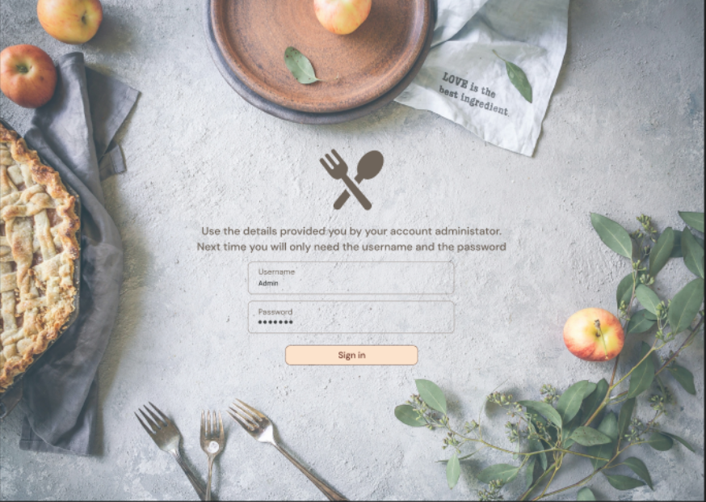
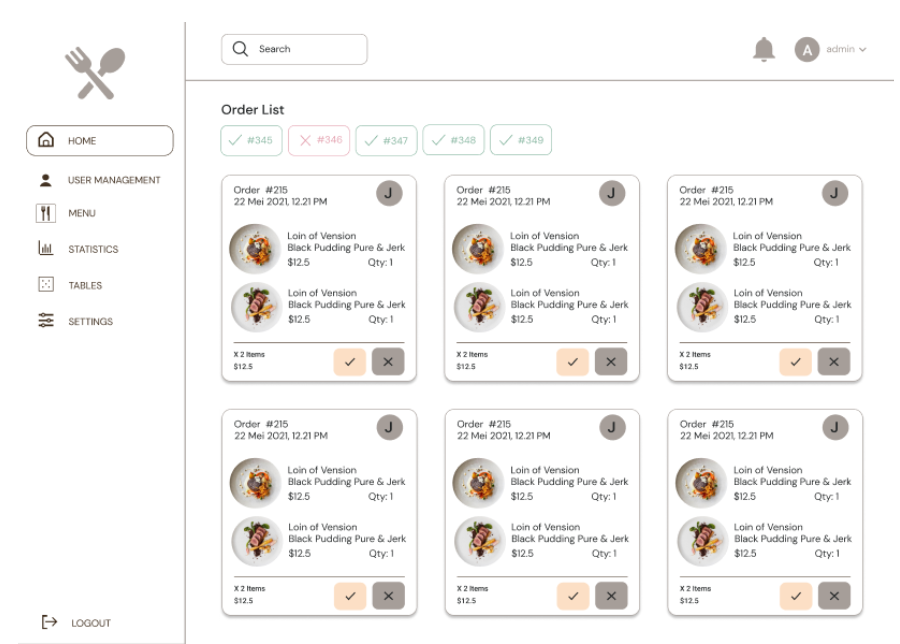
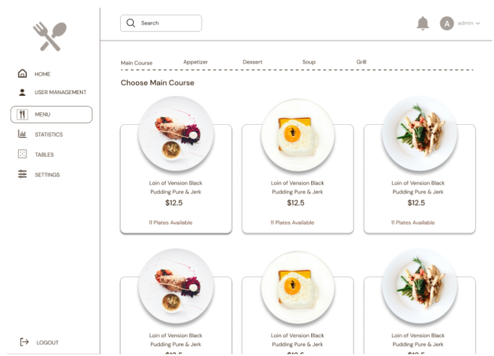

# 🍽️ Restaurant Admin Panel

A restaurant management system built with **Angular 17**.  
This project provides an **admin panel** and **staff interface** for managing restaurants, users, menus, tables, and orders.  
It is designed to work with a backend API (private GitLab project) and mobile client.

---

## 🚀 Features

### 👤 User Roles
- **Super Admin** – full system management
- **Admin** – manage a single restaurant
- **Manager** – oversee staff and restaurant operations
- **Operator** – handle specific administrative tasks
- **Cook** – receive and update orders
- **Waiter** – manage tables and serve customers
- **User** – place orders via QR code

### 🏢 Restaurant Management
- Create and manage multiple restaurants
- Add and edit menus
- Manage tables with unique **QR codes** (downloadable and printable)
- Assign staff with different roles

### 🍴 Order System
- Customers can scan a table QR code and order **without a waiter**
- Waiters and cooks can **subscribe to tables** via **WebSockets**:
  - Receive real-time order updates
  - Change order statuses:
    - Pending → In Progress → Ready → Delivered

### 📊 Statistics & Reports
- View restaurant statistics
- Export reports to **PDF**

---

## 🛠️ Tech Stack
- **Frontend:** Angular 17
- **Communication:** REST API + WebSockets
- **PDF generation:** built-in report export

> ⚠️ The backend (API & mobile app) is private and hosted separately on GitLab,  
so only the Angular project is available in this repository.

---

## 📷 Screenshots
### Login page

### Order page

### Menu page

---
